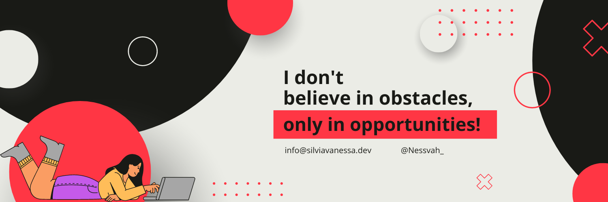

<h1 align="center">Hi 👋 and welcome! I'm Sílvia Vanessa</h1>
<h3 align="center">A passionate software developer based in Bragança, Portugal.</h3>

## 💫 About Me:
👩 Pronouns: she/her  🔭 I’m currently working on my portfolio and a social media app with JavaScript (Front + Back)  🌱 I’m currently learning React and some NodeJs/Express.  🤝I’m looking to collaborate on open-source projects whose goals and vision align with mine.  💬 Ask me about anything you want. Let's connect!  📫 How to reach me: info@silviavanessa.dev  ❤️ I love visiting new cities and meet new people.  

## 🌐 Socials:
  

# 💻 Tech Stack:
                     	    
# 📊 GitHub Stats:
 
 

### ✍️ Random Dev Quote

---

<!-- Proudly created with GPRM ( https://gprm.itsvg.in ) -->
---

<!-- Proudly created with GPRM ( https://gprm.itsvg.in ) -->

  
