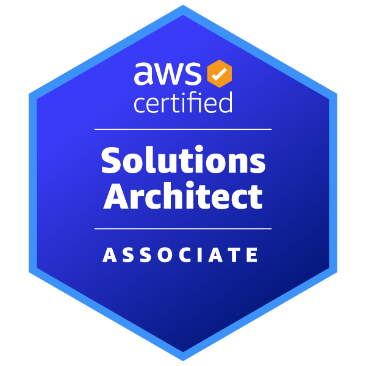
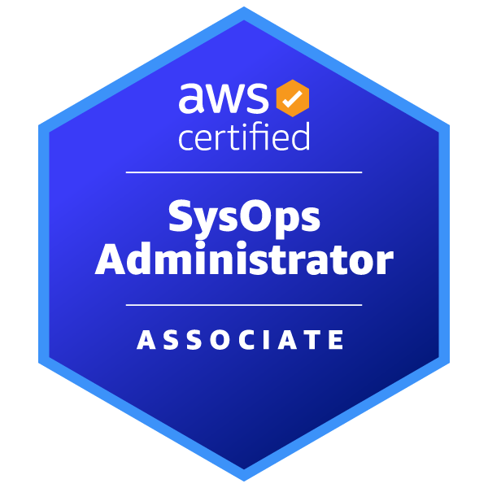

  
  <h1>Hello, I'm Sílvia Costa! 👋</h1>
  
<strong>Cloud & DevOps Engineer</strong> | <strong>AWS certified</strong> | <strong>Expanding into AI/ML</strong>

---

## 🚀 Quick Overview

- **1+ years** of hands-on experience building cloud infrastructures with AWS, Docker, and Kubernetes
- **Currently expanding** into AI/ML and MLOps to integrate intelligent solutions in cloud environments
- **Passionate about** continuous learning and implementing modern DevOps practices

---

## 💼 About Me

I'm a dedicated **Cloud & DevOps Engineer** currently working full-time, focusing on AWS cloud solutions and learning to implement CI/CD pipelines, infrastructure-as-code deployments, and containerized applications. With 1+ years of hands-on experience, I'm building my expertise in cloud technologies while maintaining a strong foundation in DevOps practices.

I'm on an exciting journey expanding into **Artificial Intelligence and Machine Learning**, focusing specifically on **MLOps practices** and **AWS AI/ML services**. My goal is to bridge the gap between traditional DevOps and modern AI operations while helping companies implement practical AI/ML solutions that solve real business problems.

---

## 🏆 Certifications

    
    

*🎯 Next: AWS Certified Machine Learning Engineer - Associate (Q4 2025)*

---

## 🛠️ Technical Skills

### Cloud & DevOps

### Programming & Development

### AI/ML & Data Science (Actively Learning)

---

## 🚀 Featured Projects

[TO DO]

---

## 📊 Currently Working On

• **Building a Personal ML Portfolio**: Developing 3 comprehensive projects showcasing different ML domains
• **AWS ML Associate Certification**: Studying for certification exam scheduled for Q4 2025

---

## 🤝 Let's Connect!

I'm always interested in collaborating on **AWS cloud projects**, **MLOps initiatives**, and **DevOps automation**. Looking for mentorship opportunities in machine learning and open to knowledge sharing with fellow engineers.

**📫 Get in Touch:**
- **LinkedIn:** [Connect with me](https://linkedin.com/in/your-profile-here](https://linkedin.com/in/nessvah)
- **Email:** info@cloudswithsilvia.com

---

## 📈 GitHub Analytics

  
  

  

---

  <i>💡 "Bridging the gap between traditional DevOps and modern AI operations, one pipeline at a time."</i>

