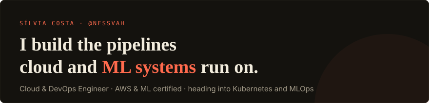
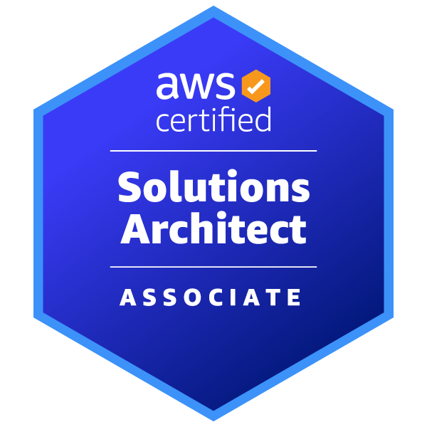
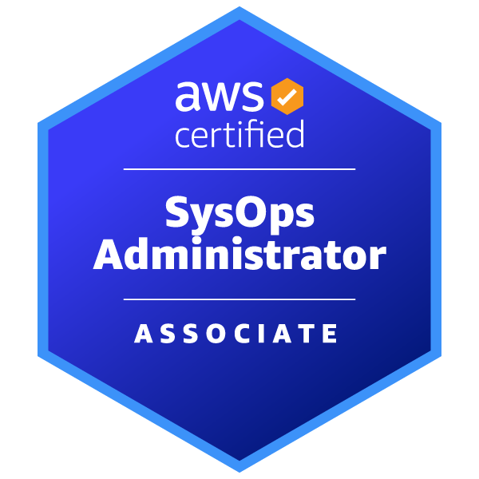
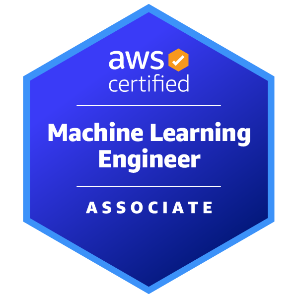
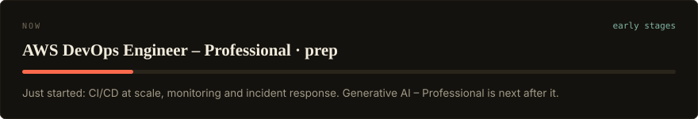

## About

I'm a Cloud & DevOps Engineer working full-time on AWS cloud solutions: CI/CD pipelines, infrastructure-as-code deployments, and containerized applications. 2+ years of hands-on experience, with a strong foundation in DevOps practices.

My work has moved from traditional cloud infrastructure into AI and Machine Learning. After earning my AWS Machine Learning certification, I'm building hands-on experience through practical projects and expanding into **Kubernetes** and **MLOps practices**, currently in early prep for the AWS DevOps Engineer – Professional while working on ML projects to strengthen my understanding of the full ML lifecycle.

The focus: practical experience across cloud infrastructure, ML operations, and container orchestration, to build well-rounded, end-to-end solutions.

## Certifications

  
  
  

| Certification | Issuer | Status |
| --- | --- | --- |
| Solutions Architect – Associate | AWS | Held |
| SysOps Administrator – Associate | AWS | Held |
| Machine Learning Engineer – Associate | AWS | Held |
| DevOps Engineer – Professional | AWS | In progress, early preparation |
| Generative AI – Professional | AWS | Planned next after DevOps Pro |

## Featured projects

### Enterprise Knowledge Assistant
*AI-powered document search using Amazon Bedrock and OpenSearch*

Built an intelligent system that transforms internal documentation into easily searchable knowledge using natural language queries. The solution leverages AWS Bedrock with Titan embeddings for semantic search, OpenSearch Serverless for vector storage, and DeepSeek as the foundation model. Users can ask questions naturally and receive context-aware answers with source links to original Confluence pages.

`Python` `AWS S3` `Bedrock` `OpenSearch Serverless` `Confluence API` `React`

**Impact:** reduced documentation search time from hours to seconds.

### Sentiment Analysis System - *planned*
*ML pipeline for analyzing customer feedback sentiment*

Building an end-to-end ML pipeline to classify customer feedback sentiment using NLP techniques. The project includes data preprocessing, model training with scikit-learn and TensorFlow, and deployment infrastructure planning. Focus on creating a reproducible pipeline and exploring model versioning and monitoring practices.

`Python` `TensorFlow` `scikit-learn` `Pandas` `AWS SageMaker`

**Learning goals:** end-to-end ML workflow, model evaluation, deployment strategies.

## Currently working on

- **Sentiment Analysis project** - end-to-end ML pipeline for customer feedback classification
- **Kubernetes** - hands-on cluster management, networking and security
- **AWS DevOps Engineer – Professional** - early preparation, Generative AI – Professional planned after it
- **MLOps fundamentals** - model deployment, versioning and monitoring

## Stack

**Cloud & infrastructure** - AWS · Terraform · Linux

**Containers & orchestration** - Docker · Kubernetes

**CI/CD & DevOps** - GitHub Actions · Git

**Programming** - Python · Bash · YAML

**AI/ML & data** - TensorFlow · PyTorch · Pandas · NumPy · Jupyter · SageMaker

## Let's connect

Always interested in collaborating on AWS cloud projects, Kubernetes deployments and ML learning initiatives. Open to knowledge sharing and to connecting with engineers on a similar path.

- LinkedIn - [/in/nessvah](https://linkedin.com/in/nessvah)
- Email - [hello@silviacosta.io](mailto:hello@silviacosta.io)
